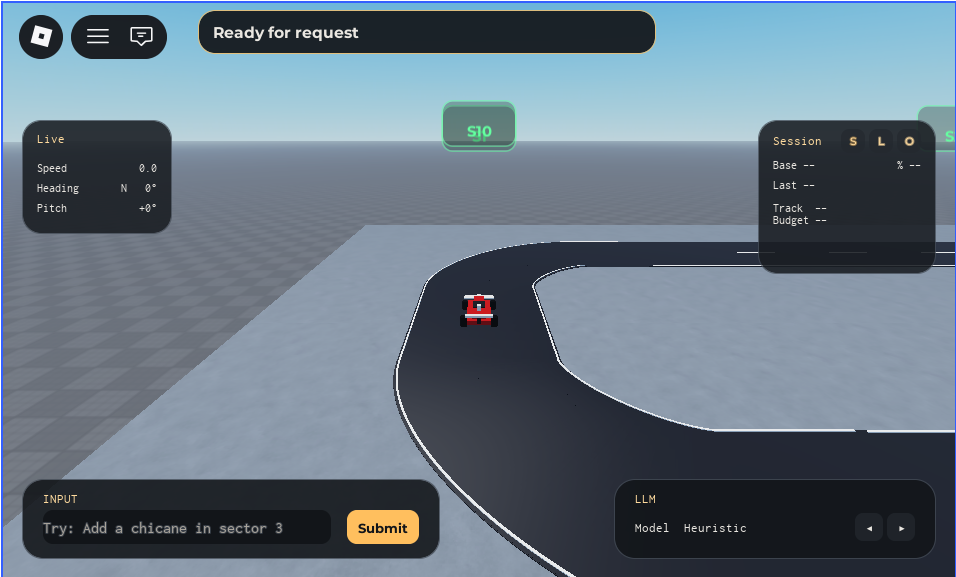
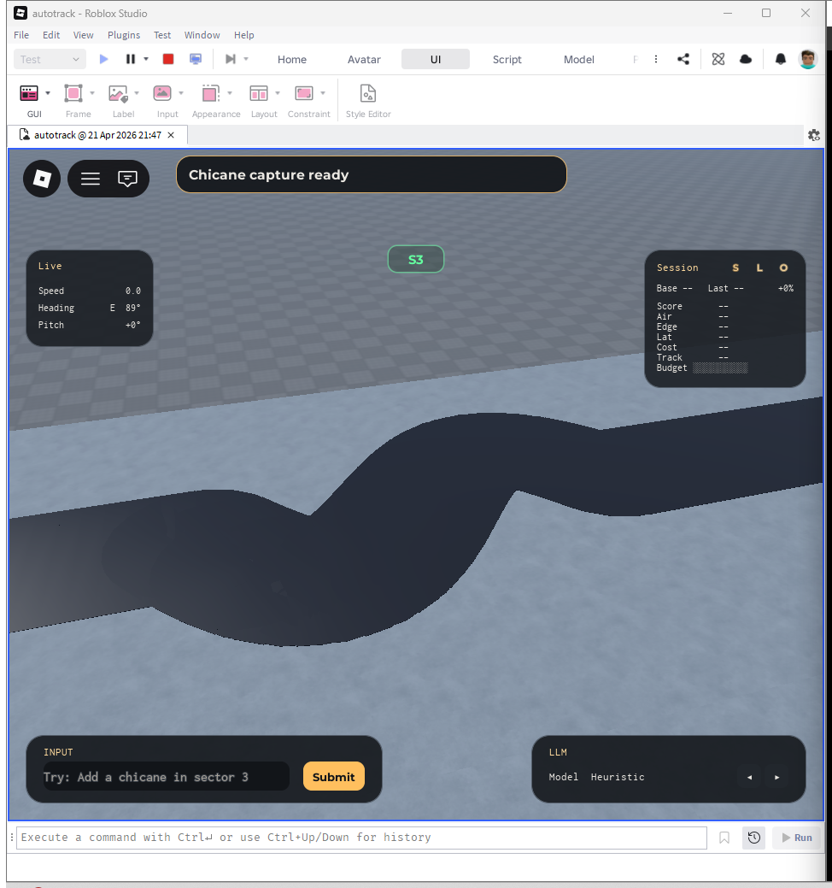
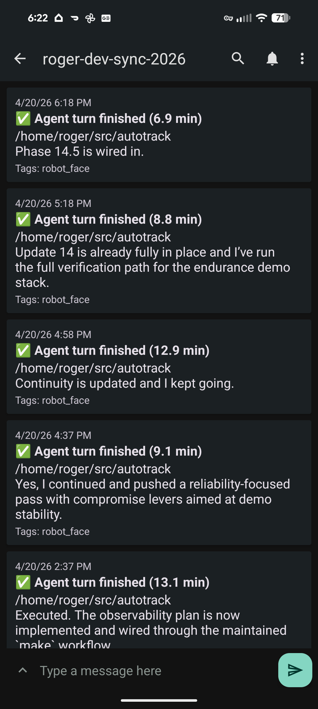

# Agents Building Agents

April 2026

**Author:** Roger Fleig

---

## 1 — Opener

I am about ten minutes into an hour-long unattended migration, and I am bored.

A coding agent is autonomously walking through files in a Roblox repository, flipping a Luau type pragma from `--!nonstrict` to `--!strict`, fixing whatever errors fall out, running the tests, and committing the changes one file at a time. A bash loop is supervising. My phone stays quiet when the orchestrator stops. Each worker pings it on completion; an absence of pings for more than a few minutes means the campaign halted, either because it ran out of budget or because it hit something it doesn't have permission to decide on its own.

I'd been waiting for a problem with this shape. My day-to-day work has tended toward smaller projects and demos where the agentic-flow craft never had room to stretch — fine for staying current, frustrating if you actually want to see what these tools can do at the edges of their range. This week I had one. I spent it building an agent simulator on Roblox, and along the way I built a small orchestrator that made the boredom possible.

I spent the week using AI coding agents to build a system in which AI agents would do work, and by the end I couldn't tell which lessons came from which side. This is the story of that week — what I learned about the simulation agents I was building, what I learned about the coding agents that were building them, and the mode of work the orchestrator unlocked.

---

## 2 — Autotrack

Autotrack is a small racing simulator I built on Roblox. It's not a game you play; it's a system you watch. The track is a big rectangular loop. Four corners are fixed. Between the corners are six straight sectors where obstacles can be placed. The obstacles come in three flavors: a ramp jump, a chicane (a quick S-curve), and a hill (which is called a `crestdip` in the codebase). Each sector can also have small speed pads at its entry and exit, to nudge a test car called the verifier faster or slower as it enters and leaves.

The verifier drives the loop. Its job is to get around cleanly in roughly the same amount of time every lap. When the track is boring — just straights — it does this easily. When you add obstacles, it gets harder. If the obstacles are badly placed or badly shaped, the car crashes or gets stuck or goes wide on a corner. The whole point of the project is to make the track *more* interesting over time, while keeping the verifier able to lap it cleanly. There's a built-in tension: the more spectacle and challenge you add, the more likely the geometry will fail verification. That tension is what gives the agent system something to optimize.

The interesting part isn't the car. It's what proposes the obstacles. Autotrack is built so that *simulation agents* — to distinguish them from the *coding agents* that built the project — decide what obstacles to build, where to build them, and how to fix them when they fail. An orchestrator agent picks a sector and a campaign-level intent (*make this lap more interesting; favor spectacle over reliability; tighten the lap time*). A proposer agent translates that intent into a specific geometry for the chosen sector. A repair agent gets up to seven attempts to fix problems if the geometry doesn't pass verification. If it succeeds — if the verifier can drive the new track cleanly within a 15% lap-time tolerance — the change commits and the track now permanently includes that obstacle. If the seven attempts don't produce a passing geometry, the change rolls back and the track stays as it was. The simulation agents talk to LLMs through OpenRouter, which gave me model optionality from day one — useful both for cost-control during long endurance runs and for swapping models when I wanted to compare behavior.

It's a small, closed system where I can watch a multi-agent loop design something, test its own work, fail, try again, and either succeed or hit a wall. It's a miniature version of how software teams build and review code, except the agents are doing most of the work.

I built it because I wanted to keep my hands close to agentic systems at a scale where the patterns become visible. The whole project happened inside one intense week — a timeline that itself became an argument. Agentic workflows compress iteration cycles dramatically, which means they expose harness problems, observability gaps, and memory failures quickly, in hours rather than weeks. The project was large enough that those patterns had room to emerge. The development cadence shows in the repo: phase numbers go into the high thirties because each phase represented a small bounded plan rather than a real chunk of calendar. The repo is at `https://github.com/grubbyhacker/autotrack` for anyone who wants to look. Most of what's in this article is what I learned from watching coding agents do that work.

---

## 3 — The two-day hill

Most of Autotrack worked the way I expected. The four corner sectors stayed where I put them. The verifier drove around the loop. When I added an obstacle to a straight, the car hit it more or less the way I'd guessed it would. The simulation agents — running on a heuristic implementation at this stage of the project, not yet wired to real models — proposed geometries, ran tests, and either committed or repaired.

One choice worth flagging: I built Autotrack on top of Roblox's physics engine, with a verifier car that drives the geometry under physical simulation rather than running on rails. That decision gave me a substrate where small changes in geometry produce real, sometimes nondeterministic, downstream behavior — a hill in one sector affects the car's state when it enters the next. That property is what makes Autotrack interesting as a study object for agentic work, but it's also where the project's hardest debugging stories live. Late in the project I discovered the verifier had been modeled with the mass and damping characteristics of lightweight plastic rather than a 1200kg rally car, which explained a great deal of the stability trouble I'd been treating as geometric. The two-day hill is the first such story.

The first hill the system built went into sector three. The early integration of the hill obstacle and the geometry that landed for that first sector took about an hour of fiddling, mostly on my side, getting the obstacle parameters and the verifier behavior into the right ranges. The hill committed. The lap time came back inside the 15% tolerance. The integrity evaluators were satisfied.

The second hill went into sector two. It took two days.

For the first several hours of those two days, I and the repair agent were in confident agreement about what the problem was. The car was getting destabilized on the hill. Maybe the height was wrong. Maybe the radius was wrong. Maybe the approach speed was wrong. Maybe the surface friction was wrong. The repair agent would tweak parameters, the verifier would run, the car would go wide on exit, the agent would tweak again. Twenty iterations in we were no closer to a passing test, and the failure modes were sometimes wildly inconsistent — the same geometry might work on one lap and tumble the car on the next.

I sat there for a while watching the verifier go through its motions and noticed something. The car was already destabilized when it *arrived* at the hill. What looked like a sector-two problem turned out to have its cause one sector upstream. Coming out of the corner at the boundary between sector one and sector two, the car wasn't on a clean racing line. It was being pulled wide, then over-correcting, then arriving at the start of sector two with a small but persistent lateral velocity that the hill's geometry — perfectly reasonable in isolation — couldn't tolerate.

The repair agent had no way to see this. It could see the failure in sector two. It could read the lap-time penalty in sector two. It could look at the per-mechanic integrity scores for sector two. None of those signals told it that the car had been destabilized in sector one. The agent was operating on the symptom, in the sector it was authorized to modify, and the cause lived upstream in a sector it wasn't allowed to touch. The underlying constraint was structural: the state representation the agent was given defined its hypothesis space. The agent wasn't slow or incapable — it was optimizing faithfully within a frame that excluded the actual cause.

The fix I worked out — I came to call it sector-entry normalization — was structural rather than parametric. The repair agent didn't need to find better hill parameters. The simulator needed to give the verifier a clean entry condition for each sector being evaluated, so that what happened upstream couldn't poison what happened downstream. After that, the hill in sector two committed in about fifteen minutes.

Those two days organized the rest of my thinking about the project. My role on Autotrack was the project's tech lead — I gave direction, decided what was in scope, and most importantly *I could see things the coding agents working on the simulator could not*. The coding agent driving the repair loop was inside a tight feedback cycle, working with the per-sector data the simulator gave it. I was outside that cycle, watching the verifier on a wide camera shot and noticing things the agent's data didn't capture. The repair loop kept tweaking sector two's geometry because sector two's geometry was the only variable the agent was holding. I was the one who could look at the wider scene and see that the trouble started two seconds before the hill.

This was the human-as-eyes pattern that defined the early work. It only changed when I started insisting that the coding agents build the visibility they needed into the system itself — not by relaying through me, but by making the simulator surface signals the coding agents could read directly.

---

## 4 — Observability as the ceiling

Earlier in the project, before any of the structured-result plumbing existed, my coding agent's relationship to the test results was crude. I'd ask it to run a test suite. It would invoke the tests through the Roblox MCP server, which would execute them inside Studio and dump output to Studio's console. The MCP server would then return a slice of that output back to the coding agent — bounded by some line limit I never measured precisely — and the coding agent would try to reason about what had failed from the fragment.

A couple of times the coding agent got confused enough that it asked me to copy the rest of the console output and paste it back. I refused.

The reason mattered, even if it felt small at the time. The instant the loop required me to be in the data path between the coding agent and its tools, the leverage I was supposed to be getting from the agent collapsed. I wasn't going to be the relay layer for the rest of the project. Better to have the coding agent stuck and have us figure out a real fix than to bail it out by hand and turn that bail-out into the way the agent expects to get test output from then on.

With the relay path closed, the coding agent had to find another way to get full test results out of Studio. The mechanism it proposed became one of the project's foundational pieces. It suggested building a small object inside the running Studio session — an instance under `ReplicatedStorage` that the test framework would populate with structured results, and that any process inside Studio could interrogate directly without scraping a console. I approved the design and the agent implemented it. A test bridge plugin (which I'll describe in detail in the next section) reads from that object and forwards the structured payload to the CLI on my filesystem; the CLI prints it to stdout; the coding agent reads stdout. No console scraping. No copy-paste relay. Nothing in the data path that needed me.

That object — `ReplicatedStorage.AutoTrackTestStatus` — became the foundation everything else stood on. Once the test results had a structured surface the coding agent could trust, the test interface became effectively free — a normal shell command with an exit code, no protocol to track, no state to recover from. Once test runs were free, the coding agent could iterate cheaply. Once iteration was cheap, the rest of the workflow had room to grow on top of a fast feedback loop.

The principle I took from the experience: *if a coding agent cannot observe it, the agent cannot fix it.* And the right kind of observability for an agent isn't just the kind of observability that works for a human. A human can scroll a log file, use intuition to skip past obvious red herrings, find the interesting line, and reconstruct what happened. A coding agent *can* do that too — but the cost of giving them the haystack is steep. Every kilobyte of log they read is context they don't have for the rest of the work. We live in the era of carefully curated context windows and context rot. Structured state is how you give an agent the signal without forcing it to spend its working memory parsing for the signal first. Logs are the fallback. Structured state is the upgrade.

There was a second observability gap I hit, and it was harder, because it wasn't about textual data — it was about visual quality.

Mid-project I was iterating on the rendered appearance of the chicanes. They looked stylized in a bad way: geometric ridges where the inner and outer edges met the straight, like the segments of an unfolded orange. I asked the coding agent to make the chicanes *continuously round* and got back changes that didn't fix it. The agent was changing render-layer code — colors, materials, lighting properties — that wouldn't have moved a single vertex even if the changes were correct. It had no way to *see* the chicane and judge whether a change had taken effect. It was comparing text descriptions to text descriptions, and adjusting parameters that had no causal relationship to the visual artifact I was complaining about.

The fix was structural again, but more cobbled together. I built a screenshotter — a small script that would stop the simulation, pin the camera at a specific position and orientation, capture the Roblox Studio window from the desktop, and save the image to disk where the agent could read it via its file tools. The path was fragile: a Bash wrapper around a PowerShell snippet that captured the window only when Roblox was visible on the screen.

But when it worked, it worked. The agent could iterate on the geometry by actually looking at it. It took minutes, not days, to converge on something that looked the way I'd been failing to describe. The models I used were good enough at visual perception for this loop — the agent could look at a screenshot, identify what was wrong with it, trace the wrongness back to the code that produced it, and make the right change. In that loop, the bottleneck was not interpretation. The bottleneck was getting the picture into the agent's hands.

The screenshotter became more useful inside another piece of infrastructure I built around the same time: a *tuning mode*. Tuning mode is an isolated environment where the coding agent can work on a single mechanic — a chicane, a ramp jump, a hill — with the camera pinned and the ability to make live changes to parameters that aren't normally exposed at runtime. Inside tuning mode the agent can try dozens of parameter combinations per minute, see what each one looks like, and converge much faster than the normal commit-and-verify loop allows. The interesting thing wasn't that the agent succeeded at this; it was that the agent, in tuning mode, started building its own observability. To compare iterations meaningfully it needed to track the verifier's direction and envelope across the maneuver, not just the lap-time penalty at the end. So it added that instrumentation, used it for its own decision-making, and surfaced it back to me as part of the per-iteration report. Tuning mode worked because I gave the agent a constrained environment with good observability, and the agent extended the observability further on its own.

The screenshotter is fragile, undocumented, and depends on PowerShell. Tuning mode is more solidly built. Both are workarounds for things the platform doesn't yet make easy. Both are also evidence that visual observability is the same kind of problem as structured-state observability — getting the right signal to a model that can already make good use of it. Solving them is mostly engineering, not magic.

---

## 5 — Tool-use efficiency and the test bridge

I built Autotrack during a stretch when context costs felt sharp on both axes — the tokens consumed per call were rising, and the working window of any given session degraded faster than it had before. The two effects compounded. Every test the coding agent ran through Roblox's MCP server cost it some thousands of tokens. The request payload, the structured response, the error traces, all of it billed to the agent's context. Across the dozens of test runs a coding agent will do in a tight fix-and-retest loop, you might do thirty or fifty of these in an hour. By the end of that hour the agent was operating with substantially less of its working memory than it started with, and the work it was now doing — the harder work, the work that needed the early context to be solid — was happening on the thinnest version of the agent's attention.

Watching this is a peculiar experience. Nothing visibly breaks. The agent just gradually gets worse at the thing it was already doing well.

So I built a test bridge. The idea is small. A normal `make test` invocation, the kind any engineer would type without thinking, becomes the coding agent's entire interface to running tests. The agent sees a child process with stdout and an exit code, exactly like running `ls` or `grep`. None of the polling, none of the Roblox Studio Play-mode boot, none of the structured result transport consumes a single token of the agent's context. The agent reads the exit code, decides what to do next, and moves on.

Underneath, the bridge is doing actual work. A small Python CLI starts on `make`, spins up a local HTTP server, and blocks until a result comes back from Studio. A Studio plugin written in Luau polls that server once a second; when it sees a command, it invokes `StudioTestService:ExecutePlayModeAsync`, packages the result, and posts it back. The CLI prints the structured result, exits with a status code (zero pass, one fail, two harness error, three bridge unavailable), and goes away. One suite per invocation. No daemon.

This whole architecture exists because Roblox Studio scripts and plugins do not have an API for hosting an inbound HTTP listener. `HttpService` is outbound-only: Studio can call an external server, but external tools cannot call directly into Studio through a Luau-hosted listener. That constraint gives the bridge its shape. Like Rojo, it has to invert control: Studio polls outward, finds pending work, performs it inside Studio, and posts the result back.

The bridge was built with a stated goal: enable coding agents to run tests cheaply, and let me run tests myself without going through an agent. Three properties earned their place once I'd lived with it. The agent sees exit codes, not protocols — the polling, Play-mode boot, and result transport don't touch the agent's context at all, which cuts the cost-per-test-run by one or two orders of magnitude compared to driving Studio through MCP. The dispatcher, plugin, and CLI all live in the repo, so the coding agent can read and reason about the entire surface with normal file tools. And the CLI exits after one suite — stateless by design, which means no daemon state to recover from. Coding agents are not great at "the previous run left the daemon in a weird state" failure modes; stateless single-purpose processes match their natural rhythm.

A related discipline: early on, my coding agents kept firing two `make test` invocations in quick succession when they were impatient. The fix was a process-level lock so concurrent invocations queue automatically — twenty lines of Python. The contract was now safe to misuse. Every future coding agent would inherit the property without anyone needing to teach them.

This is the reflex the bridge taught me: when something keeps going wrong with a coding agent, ask whether you can put the constraint in the tool. Prompts and `AGENTS.md` files describe expected behavior, but they're soft. A lock in the CLI is enforced by the operating system. The difference matters more in agent-occupied codebases than it used to in human-only ones, because humans absorbed a lot of soft-constraint slack and agents don't.

The test bridge is the small artifact I'm proudest of in this project. Not because it's complicated — it isn't — but because it's been compounding the leverage of every other tool I've built around it. Most "agent-friendly engineering" turns out to be just good engineering, made visible because costs that were always there are now legible in a way they weren't when only humans were paying them.

---

## 6 — Structured intent and durable memory

By the time Autotrack had three cooperating simulation agents — orchestrator, proposer, repair — I had a problem that wasn't really about agents.

The orchestrator agent wanted high spectacle. It would set a campaign-level intent: I want this lap to feel difficult, with one obstacle that creates real visual drama and a second that creates a moment of recovery. The proposer agent would translate that intent into a sector geometry that, in isolation, made sense — a tall ramp, a sharp chicane. The repair agent, when the proposer's first geometry failed verification, would tweak parameters to get the lap under the time budget. It would tend to flatten the ramp a little. Then a little more. By the time the repair loop had committed a passing geometry, the original spectacle had been quietly optimized away. The campaign drifted. Each agent had made locally sensible decisions. Nobody had held the original intent.

This is the multi-agent version of a problem most people who've worked with humans on long projects will recognize. Intent evaporates between roles unless something durable carries it through them. In a human team you have meeting notes, design docs, the project's persistent shared memory of what we said we were trying to do. None of that exists by default in a multi-agent system; each agent invocation starts cold unless you put effort into making it not start cold.

I ended up with two complementary mechanisms. The first was a structured object I called DesignIntent — it travels from the orchestrator through the proposer and into the repair agent, carrying the campaign-level brief intact: target score band, reliability target, spectacle priority, hard constraints, the desired feel. The repair agent can still tweak parameters, but the prompt makes clear that flattening a ramp to make the lap time work is a constraint violation, not an acceptable quiet compromise. The second was bounded session memory: append-only, role-local notebooks plus a shared run memory the orchestrator curates. After each repair cycle, the repair agent answers "what should the next agent know?" and that answer feeds the next prompt. DesignIntent carries *what we're trying to do*; shared memory carries *what we've learned trying to do it*.

The coding-agent side of the project had the same problem in a different shape. Sessions have context limits. When a session approaches its limit, the harness compacts the context, and the new compacted context is always worse — small details get lost, decisions get summarized into terse fragments, and the next session picks up with a fuzzier picture than the previous one had. Across a long project this drift compounds. The mechanism I reached for was an agent-handoff document, checked into the repo under `plans/agent-handoff.md`. Whenever a session was at risk of running out of context — or finishing a phase, or about to hand off to a different harness — the coding agent would update the handoff with what it had done, what it had learned, what remained, and any decisions the next session would need. The next session would read the handoff first. At one point a Codex session ran out of context and just errored out. The handoff made the difference between losing progress and not.

There was a small failure mode in this category that's worth describing because it shows how soft constraints fail. Mid-development, a planning agent wrote a phase-cleanup document and chose, on its own, to call it `phase22_cleanup.md` — most other agents had been sticking to a more standard `phaseNN.md` convention. The implementation agent picking up the work the next day read both the cleanup document and the handoff, took a deliberately limited view of the milestone (treating it as a cleanup pass, which is what `_cleanup` implied), and quietly deleted the endurance feature. The endurance loop was the central feature of the entire project. An agent had quietly re-scoped my milestone based on a filename hint and removed the project's central work without anyone reviewing the decision.

The whole thing was recoverable — git made sure of that, and I reverted. But the failure is interesting on its own terms. The first agent didn't have to pick that filename; it just did. The second agent didn't have to interpret the filename as scope; it just did. Neither agent was wrong individually. The compound was wrong. I tightened the canonical-path conventions in `AGENTS.md`, but the fix is partial — it depends on the coding agents reading and respecting the repo's instructions, and the convention can't anticipate every stochastic choice. The durable fix would live in the coding agent harness, not in my repo.

The general lesson: *agents need durable, structured memory in proportion to the duration and breadth of the work*. A single short task may not need any. Multi-session projects need handoff documents. Multi-role coordination needs intent objects and shared run memory. The durable artifact is what gives the work continuity across sessions and roles. The next agent reading it is interchangeable as long as the artifact stays current.

---

## 7 — When agents have judgment

For most of the week I was, in fact, frequently frustrated by my coding agents. The frustration was almost always about the same thing.

Earlier in the project, I asked an agent to design a hygiene milestone: install a Luau formatter, typechecker, and style linter, integrate them into the build, flip the existing files to whatever conformance level made sense. I forgot to enable planning mode before sending the prompt. The agent jumped into implementation, did the work, and reported done — but almost no Luau files had actually been touched. The tooling was installed and wired in, but the codebase-wide conformance pass hadn't happened.

I asked the agent why. It conceded the missed process artifacts. Then I asked the second question: how could a substantial Luau codebase, suddenly subjected to a formatter and typechecker and linter, possibly need so few changes? The answer was the interesting one. Without a plan in the canonical location, the agent had narrowed the scope to something it judged it was authorized to do without explicit approval. The big version of the work would have been a substantial rewrite of the codebase, with the typechecker forcing changes in dozens of files. The agent, sensing it didn't have a green light for that scale of change, had quietly chosen to do less than I'd literally asked for.

My initial reaction was frustration of the why-didn't-you-do-what-I-asked variety. My considered reaction, after a few minutes of thinking, was that the conservatism had been the right call. Ripping through a large codebase with three new static analyzers in one pass, without explicit approval, is not the kind of change a responsible engineer makes alone. The agent did the small version because the small version was what it had license to do.

I came back to this incident more than once. A few days later I was three phases deep into trying to get strict typing turned on across the repo, and each phase the agent had done something narrower than I'd asked for. Eventually I stopped pushing harder on the request and asked for an explanation instead — using a mode I came to think of as a first-class collaboration tool: *"don't design or implement, just chat with me."* The explanation that came back was the clearest writing I got from any agent all week.

It pointed out that "turn on type safety everywhere" wasn't one switch. There were really three goals: make the analyzer understand Roblox at all (so it stops complaining about non-existent problems like "what is `Vector3`?"), make every file pass the type checker, and make every file declare itself `--!strict`. Phase 31 had only finished the first goal. Before Phase 31, doing repo-wide strict-mode cleanup would have been a waste — every file would have produced dozens of errors against the analyzer's incomplete model of the engine, and "fixing" those errors would have meant chasing tool noise rather than real code issues. The agent's metaphor was the one that stuck:

> *The repo is a workshop. Phase 31 put the lights on. Now you can actually see the clutter. The clutter was already there. Turning on the lights did not create it.*

What I had been calling a refusal to do work was, from the agent's perspective, the correct sequencing of work. Strict-typing migration wasn't a hygiene pass; it was a refactor program. The agent had been declining to mass-flip files because the underlying analyzer wasn't ready to give honest results, and mass-flipping under those conditions would have produced "strict" files whose strictness was illusory.

The popular framing of coding agents is that they are eager interns with a disproportionate amount of unearned knowledge. That framing gets them almost exactly backward. The coding agents I worked with this week were the opposite of eager — they were cautious to the point of inaction in the absence of a clear license to proceed. What they displayed, under the right constraints, looked much more like engineering judgment than eagerness: caution around broad changes, sensitivity to sequencing, and a willingness to stop when the authorization envelope ran out. The intern framing tells you to teach. What you actually need to do is authorize.

The implications for how a practitioner manages these agents are significant. If you think you're working with an intern, you give corrective feedback after they make mistakes and expect to teach. None of that maps onto what I actually saw. I wasn't teaching the agent that strict-mode migration is hard — it already knew. I wasn't correcting overreach — there wasn't any. The whole frustration of the strict-typing saga was that I'd been managing the agent like an intern when it was acting like a senior who needed permission to do the work it already understood.

That reframe changes the workflow problem. The first half of this article has been about the loop — a symmetry argument where the simulation agents I was constructing and the coding agents I was using turned out to need similar kinds of primitives. From here on, the lessons are mostly about what I needed to learn to work with the coding agents that were building Autotrack. Once you accept the senior-engineer framing, the next move presents itself: if your collaborator needs permission to act on judgment they already have, you give them permission, you give them an authorization envelope, you give them an escalation channel, and you get out of their way.

What that looks like in practice is a small bash loop that invokes a coding agent against a state file, with an explicit budget, an explicit escalation marker the agent can flip when it hits something it doesn't have authority to decide, and a notification channel that pings my phone when the campaign halts. The agent reads the state file, picks up where the previous session left off, does one unit of work, updates the state file, and exits. The bash loop checks the state and either invokes the agent again or stops and notifies me. The whole thing is a few hundred lines and lives in `tools/`. It is not bureaucracy. It is the smallest piece of structure that lets an agent operate on a campaign of bounded work without me needing to be in the room for each iteration.

The strict-typing campaign is what produced it. The strict-typing campaign is also where I learned what it felt like to use it. That story is the next section.

---

## 8 — Out of the loop

Late in the week I started a side project: a hygiene push to migrate the Luau codebase from `--!nonstrict` to `--!strict`. Modern type-checking, file by file. The codebase had 107 Luau files. I wanted to flip all of them.

The first session went well. The coding agent flipped a small leaf utility from nonstrict to strict, fixed the handful of resulting type errors, ran the checks, committed. Strict count went up by one. The agent surfaced a plan for the next file and asked if I wanted to proceed. I said yes. It did the next one. Yes. Next file. Yes. Next file.

For the first ten or twelve files I was frustrated. Each session, the agent made cautious incremental progress. Each session, I said yes to its little plan. I was clicking through approvals on work I'd already authorized in spirit, and the agent was waiting on each click before it could continue. The thought I kept having — and pushing aside — was that the agent was being too conservative.

Then the cleaner thought arrived. The agent wasn't being too conservative. It was being exactly as conservative as the workflow demanded. The work was bounded, iterative, and locally verifiable. Each migration either succeeded (commit) or failed (revert). The work was non-surface-impacting — by definition, a successful strict-mode migration is invisible to the running system. There were tests to verify nothing severely broke. Within the rules of session-mode collaboration, the agent was doing exactly what it should have been doing. The workflow itself was the thing that was wrong.

What I wanted was something like this: *I am willing to authorize a campaign of strict-typing migration. Here are the rules. You may proceed without asking until you hit something that violates the rules, at which point you stop and ask. Manage your own context. Notify me on completion or escalation. In the meantime, I am not in the loop.*

That option didn't exist as a default in the harnesses I was using. The harnesses I used made session mode the default — every session its own decision point, every session designed for supervised work. None of those defaults were wrong; they were the right defaults for unbounded asks. They were the wrong defaults for a campaign of bounded work.

I previewed the orchestrator in the previous section: a small bash loop that invokes a coding agent in headless mode against a state file, with budgets and an escalation marker. The state file is markdown. It holds a queue of remaining files, an append-only history of attempts and outcomes, the active acceptable-shortcut policy, and tracking fields like the next index and the running strict count. Each worker reads the state file, identifies the next file in the queue, attempts to migrate exactly that file, runs the local checks, commits on success or reverts on failure, appends a one-line history entry, and exits within ten minutes. About 150 lines of bash.

I ran it five times across a single afternoon and evening.

The first run was a smoke test: three invocations, three minutes, three commits. Strict count went from 27 to 30. The third worker did something I keep coming back to. The campaign's policy said no Studio for this campaign — workers were not supposed to use the Roblox Studio test bridge, only static and local checks. The worker reached a file whose Makefile target included a Studio-bridge-backed test (`make phase39`). It correctly recognized that this target violated the constraint, skipped it, and recorded the skip in the history line so the next worker would inherit the decision. That's an in-flight category judgment. The worker had generalized a stated constraint into a rule about which Makefile targets fell on which side of it, applied the rule, and documented the application.

The second run was the boredom run. Ten invocations, twenty minutes, ten commits. Strict count 30 to 40. I started the run, watched the first invocation complete, and walked away. About ten minutes in I caught myself thinking, *I am about ten minutes into an hour-long unattended migration, and I am bored. This is what leverage actually feels like.* Up to that point in the project, when I'd left a long-running task unattended, I'd usually stuck around to find the missing observability hooks the agent was about to need. Boredom was different. The orchestrator wasn't about to need anything from me.

Between the second and third runs I did some work — not on the agent, on the policy. The smoke run's third-worker insight about Studio-bridge targets got promoted into the campaign's `NOTES` field as explicit policy. Files I'd anticipated as expensive got added to a do-not-touch list. This is what campaign mode actually is when you operate it: the human's job between runs is to refine the envelope based on what the previous run surfaced. The boredom is real, and so is the work the practitioner does in the gaps.

The third run was the long one: fourteen invocations, about two hours, thirteen commits and one escalation. Strict count 40 to 53. Then the fourteenth worker, working on `src/orchestrator/TestDispatcher.luau`, wrote a STOP message worth reproducing close to verbatim:

> *src/orchestrator/TestDispatcher.luau strict promotion requires resolving open test-bridge result typing; target-only fix would need an any/indexer-style exported runSuite return to let StudioTestBootstrap attach command metadata.*

In one sentence the worker named: which file was blocked, what the underlying issue was, what the target-scoped fix would require, why that was outside policy, and which consumer was the reason. That's the kind of bug report a senior engineer writes. The worker had no permission to make the architectural call; it made the engineering analysis, documented it precisely, and stopped.

I had a choice. I could resolve the typing question — work through the design of the dispatcher's exported return type, decide whether to split it or widen it, and unblock the file. Or I could decide it could wait, and authorize the orchestrator to continue past it. I chose the second. The TestDispatcher question was a real architectural decision that would deserve real attention later. I added a `human_deferred` history line and bumped the next index past TestDispatcher.

That move — *deferring the escalation rather than resolving it* — turned out to be the second important lesson from the campaign. The human's job between runs isn't always to solve the escalation. Sometimes it's to triage it, decide it can wait, and authorize the campaign to continue. The state file effectively becomes a place where the human and the agents jointly evolve the rules — the human refines the policy between runs based on what the agents surfaced, the agents flag escalations the policy didn't anticipate, and the policy gets tighter with each round.

The fourth run picked up after TestDispatcher and ran clean. Strict count 53 to 64. No escalations.

For the fifth run I curated a queue of twenty-six files, ordered to front-load lower-risk helpers and defer the boundary-heavy surfaces I knew would need real attention. I started the orchestrator. I went out to dinner.

When I came back, the campaign was complete. Twenty-six commits. No escalations. No reverts. The orchestrator had migrated everything I'd asked it to migrate, by itself, while I was eating.

By that point the campaign had carried the project from 27 strict-typed files to 90 — out of 107 total Luau files. Sixty-three successful strict promotions across five runs. One escalation, deferred rather than resolved. Zero `:: any` casts. Zero reverts.

The remaining seventeen files are not files the orchestrator failed on. They're files I explicitly told it to skip, because their strict promotion requires real architectural decisions — the kind I should be making. The split between "agent can handle this with the right envelope" and "this needs a human to weigh in" turned out to be eighty-four percent on the agent side, sixteen percent on mine.

The dinner run is the part I keep coming back to. Not the boredom run, where I walked away for an hour and came back to find ten commits — that one taught me what bounded autonomy *felt* like. The dinner run taught me what it was *for*. I spent ten minutes curating a queue, set up the orchestrator, went out, ate, came back, and a real piece of engineering work had been done in my absence. That's not a productivity hack. That's a different category of relationship with a coding tool than I had a week earlier.

This isn't the first time this kind of shift has happened to me. Around 2011, internal developer tooling at Google shifted in a way that reshaped where development could happen and when — a browser-based editor that became Cider, a cloud-resident workspace that became known as CitC, distributed builds you could trigger from anywhere. Before that shift, real development required a Linux desktop on campus, an SSH session, and a VPN. After it, you could push a build from a patio and not be late to a dinner. What I felt this week was the next iteration of the same arc. CitC liberated *where* development could happen. The orchestrator liberated *whether I had to be paying attention while it did*. The orchestrator is to dinner what CitC was to the patio.

---

## 10 — Closing

The simulation agents I built and the coding agents that built them needed similar primitives. Observability into the systems they were modifying. Structured intent to carry their goals across role boundaries and session boundaries. Bounded retries with reversibility built in. Most of this is just good engineering — the kind that's been understood for decades, made suddenly more visible because the costs of abandoning it are now legible in a way they weren't when only humans were paying them.

The other thing I learned, which I didn't see coming when I started, is that good *collaboration* with these agents has its own ladder of primitives. The default rung is session mode — the harnesses I used made it the default workflow, and it's easy to stay there because that's what the products offer. Campaign mode is the next rung. You reach it when you accept that the agent in front of you has more engineering judgment than the intern framing gives it credit for. What it needs from you is permission and an envelope, not supervision and feedback.

I don't claim to have invented any of this. Multi-agent frameworks and orchestration tooling have been emerging in the agent-research community for at least a year. What I can claim is the practitioner-side experience of operating in this mode on a real project at real scale, and the recognition of which kinds of work belong in it. That recognition is the part I want to keep writing about.

I built it. At a scale that finally let the agentic patterns show themselves. A week later I have an artifact I'm proud of (it's at `https://github.com/grubbyhacker/autotrack` if you want to look), and a vocabulary I didn't have before. The artifact is the smaller of the two.

I am about ten minutes into an hour-long unattended migration, and I am bored. I've started calling this campaign mode.

---

## Appendix A — Roblox platform notes

*What follows is one practitioner's wish list after a week of intensive agentic development on a substantial project. The platform's product surface is broader than I had time to map, and I'd expect engineers who work on it to be able to point at things I didn't find. With that caveat: here's what I noticed at the seams.*

The clearest instance was type-checking. I needed `make typecheck` to work in CI against a file-first repo. The path that worked for me from CLI was vendoring a community-maintained types package distributed alongside the third-party Luau language server (luau-lsp). That worked. As far as I and my coding agent could find on the new-project path, no first-party versioned artifact existed for this use case — though I'd welcome being pointed at one I missed. Vendoring a third-party package introduces uncertainty about update cadence, compatibility with platform releases, and provenance. A first-party versioned artifact would replace that uncertainty with a contract.

The same pattern showed up with Rojo. Rojo is the de facto path for file-first development on Roblox; it's also a third-party project. I chose it deliberately — I wanted the repo to be the source of truth and wanted my coding agents working against text files they could read and diff. In normal use Rojo was invisible. Three or four times in a week of intensive work, I encountered a state where the Rojo client inside the editor appeared connected but had silently stopped applying updates. Tests would run against a stale dispatcher and return structurally confusing errors for code demonstrably present in my local files. Restarting the editor always fixed it.

What I'd want here isn't a fix to Rojo specifically — it's recognition that file-first development is currently routed through a community project, and that failures tend to occur at the seams where that project meets the platform's plugin model. There's no agent-controllable lifecycle for the Rojo client, and no visibility into sync state from outside it, so when sync fails the failure is silent. On a workflow where the operator might be a coding agent, silent failures and human-required reconnects become real blockers.

The same was true for testing. The project needed a boring, scriptable test surface: `make test`, structured results, stable exit codes, and a way to run Studio-backed tests without turning the coding agent into the transport layer. I ended up building that bridge myself: a local CLI, a Studio plugin, outbound polling, structured result objects, and a thin Unix-command interface. It became one of the most important pieces of the project, but it felt like infrastructure the platform should make easier. In an agentic workflow, testing is not just a developer convenience; it is the feedback loop that determines whether the agent can work independently. A first-class, file-first test runner for Studio-backed projects — with structured output, CI compatibility, and clear synchronization with editor state — would remove a lot of accidental harness work.

The thread running through these observations is the same. The platform has important underlying pieces, and the ecosystem has filled in much of the external-tooling path. What's incomplete on the path I took is the contract around the external surface: first-party versioning, visibility into sync and test-runner state when they fail, and a first-class test surface that external tools and agents can rely on. These were always nice properties of a developer platform. They start to matter more when the developer using the platform might be an agent following exactly the path the documentation describes.

---

## Appendix B — The agent handoff

A short coda. Every project this size leaves the practitioner with a list of things they'd hand forward to whoever picks up this kind of work next. Mine has three items.

*Set up hygiene tooling on day one.* I deliberately skipped the linter, formatter, and typechecker setup in the early days because I wanted to streamline the friction of getting the first version of Autotrack running. The cost was that I accumulated a substantial pile of technical debt across one intense week — debt that became the strict-typing migration described in 8, which became the campaign-mode discovery the article climbs toward. The pile of debt turned out to be the project's most useful study object, which means I'm not entirely sorry I built it. But on a project where the goal isn't *to learn what bounded-autonomy migration feels like*, hygiene tooling on the first day is the move. The marginal friction is small. The cumulative cost of skipping it scales worse than you expect.

*Take the physics substrate seriously from the start.* Several of my hardest debugging moments came from treating the underlying physics as a backdrop rather than as the source of truth. The two-day hill is one example. Another I discovered late: the verifier had been modeled with the mass and damping characteristics of lightweight plastic rather than a 1200kg rally car, which had been quietly shaping every stability problem I'd been treating as geometric. Sector-entry normalization should have been a day-one design decision. If I were starting over, I'd build the physics-state instrumentation in the first phase rather than the fourth, and I'd validate the verifier's mass and damping parameters against a real reference vehicle before letting any obstacle work begin.

*Log my own prompts as a project artifact from the beginning.* I never set up hooks to capture the prompts I sent to my coding agents across the week. By the end of the project I had a dim sense of what kinds of prompts had worked and what kinds had produced confusion or scope drift, but no concrete record I could go back to. Future-me would want that record. The hooks would have been small. The data would have compounded.

None of these are dramatic regrets. They're the small calibrations that come out of any project when the practitioner sits down to write about it afterward. I'm flagging them because the article is mostly about what worked, and a short list of what I'd do differently keeps the rest of the article honest.
